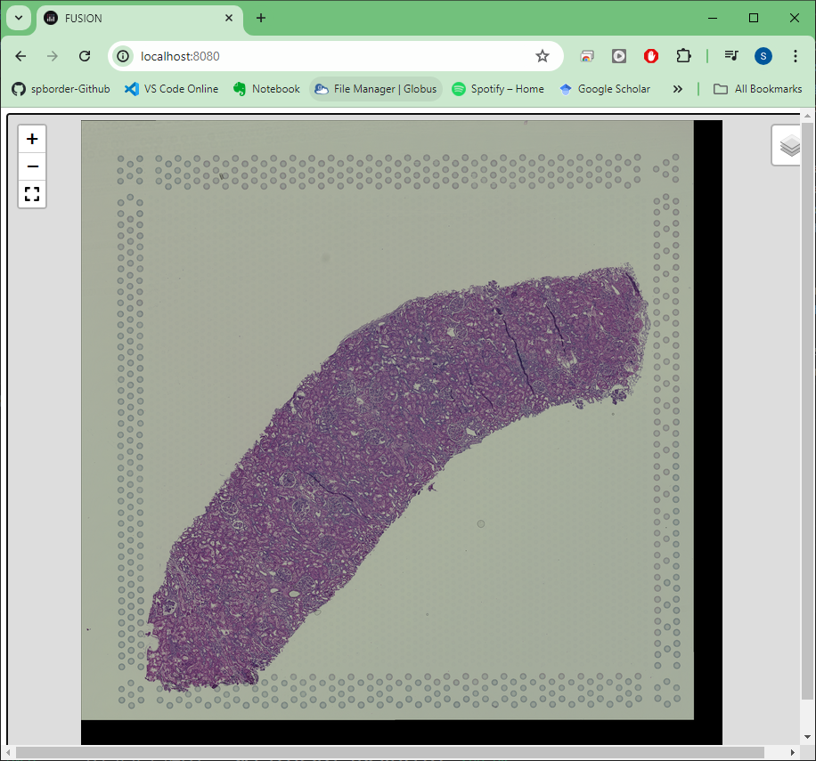
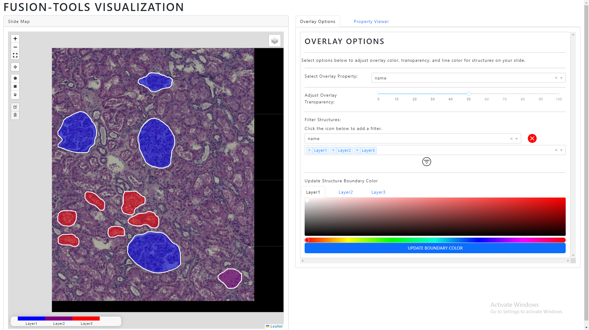
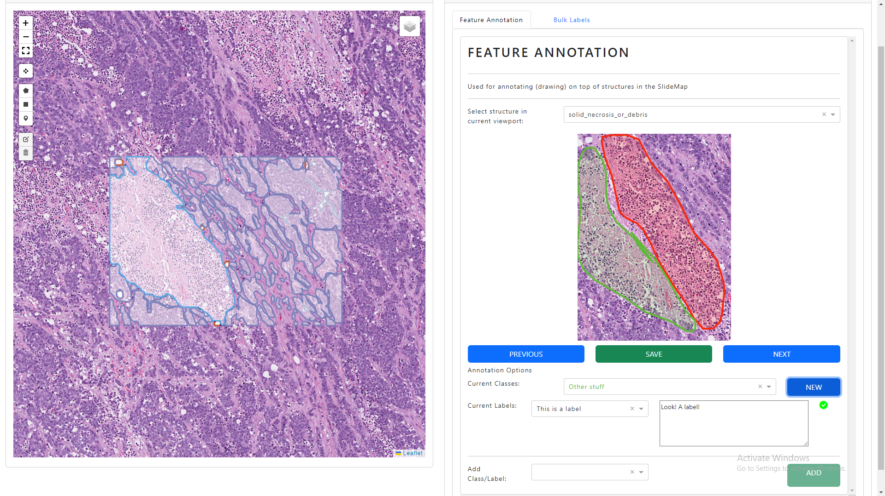
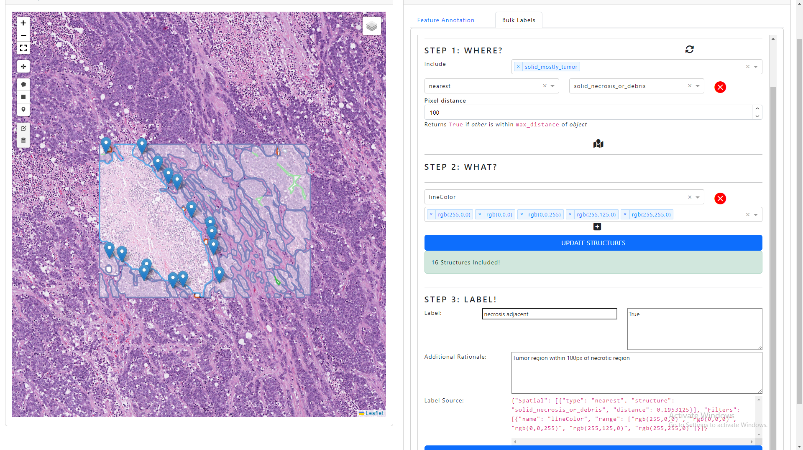
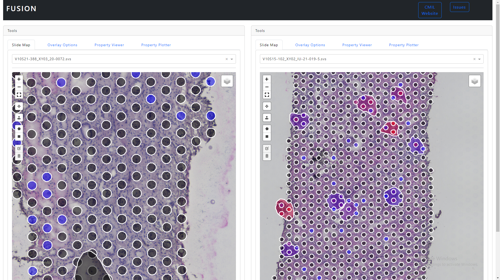
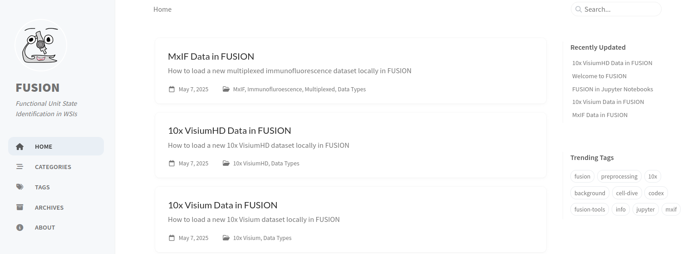

# *fusion-tools*
Modular visualization and analysis dashboard creation for high-resolution microscopy images.


## Installation

`fusion-tools` is deployed through PyPI and can be installed using:
```bash
$ pip install fusion-tools
```

## Usage

`fusion-tools` is intended to bring some of the functionality found in FUSION to developers working with whole slide images (WSIs) stored locally. 

One such example would be the `Visualization` and `SlideMap` class:
<div align="center">
    
</div>

```python
from fusion_tools.visualization import Visualization
from fusion_tools.components import SlideMap

vis_session = Visualization(
    local_slides = [path_to_slide]
    components = [
        [
            SlideMap()
        ]
    ]
)

vis_session.start()

```

The `Visualization` class lets users construct custom layouts of different tools by passing a list containing rows, columns, and tabs. (e.g. [ [column in row 1], [ [ tab 1 in column 2 in row 1, tab 2 in column 2 in row 1] ], [ [ column 1 in row 2 ] ] ] ).

By passing a list of paths to locally-stored whole slide images (WSIs), `fusion-tools` automatically generates a `LocalTileServer` which is bundled in with the `Visualization` session to allow for high-resolution image viewing.

<div align="center">
    
</div>


```python

from fusion_tools.visualization import Visualization
from fusion_tools.components import SlideMap, OverlayOptions, PropertyViewer
from fusion_tools.utils.shapes import load_aperio


path_to_slide = '/path/to/wsi.svs'
path_to_annotations = '/path/to/aperio_annotations.xml'

annotations = load_aperio(path_to_annotations)

vis_session = Visualization(
    local_slides = [path_to_slide],
    local_annotations = [annotations],
    components = [
        [
            SlideMap(),
            [
                OverlayOptions(),
                PropertyViewer()
            ]
        ]
    ]
)

vis_session.start()

```

You can also access remote tile servers (either through `DSATileServer` or `CustomTileServer`) as well as annotations stored on a [Digital Slide Archive](https://digitalslidearchive.github.io/digital_slide_archive/) instance.

<div align="center">
    
</div>


```python

from fusion_tools.visualization import Visualization
from fusion_tools.handler.dsa_handler import DSAHandler
from fusion_tools.components import SlideMap

# Grabbing first item from demo DSA instance
base_url = 'https://demo.kitware.com/histomicstk/api/v1'
item_id = '5bbdeed1e629140048d01bcb'

# Starting the DSAHandler to grab information:
dsa_handler = DSAHandler(
    girderApiUrl = base_url
)

# Checking how many annotations this item has:
#print('This item has the following annotations: ')
#print(dsa_handler.query_annotation_count(item=item_id).to_dict('records'))

vis_session = Visualization(
    tileservers = [dsa_handler.get_tile_server(item_id)],
    components = [
        [
            SlideMap()
        ]
    ]
)

vis_session.start()


```

You can also use some of `segmentation` components for adding labels and annotations to structures in the slide.

### Creating annotations on top of structures
<div align="center">
    
</div>

### Applying labels to many structures at the same time
<div align="center">
    
</div>

```python

from fusion_tools.visualization import Visualization
from fusion_tools.handler.dsa_handler import DSAHandler
from fusion_tools.components import SlideMap, FeatureAnnotation, BulkLabels

# Grabbing first item from demo DSA instance
base_url = 'https://demo.kitware.com/histomicstk/api/v1'
item_id = '5bbdeed1e629140048d01bcb'

# Starting the DSAHandler to grab information:
dsa_handler = DSAHandler(
    girderApiUrl = base_url
)

# Checking how many annotations this item has:
#print('This item has the following annotations: ')
#print(dsa_handler.query_annotation_count(item=item_id).to_dict('records'))

vis_session = Visualization(
    tileservers = [dsa_handler.get_tile_server(item_id)],
    components = [
        [
            SlideMap(),
            [
                FeatureAnnotation(
                    storage_path = os.getcwd()+'\\tests\\Test_Annotations\\',
                    labels_format = 'json',
                    annotations_format = 'rgb'
                ),
                BulkLabels()
            ]
        ]
    ]
)

vis_session.start()


```

### New in *fusion-tools*>2.0.0!
Now you can add multiple slides to a single visualization session and you can even view them side-by-side!
- By default, components in the same *row* are **linked**, or they can interact with each other through callbacks. This can be updated using the "linkage" kwarg when initializing a `Visualization` session.
- If two of the same types of components (e.g., two `SlideMap` components) are placed in the same row and "linkage" is set to "row", callbacks will not work. **Beware!**

```python

from fusion_tools.visualization import Visualization
from fusion_tools.components import SlideMap, OverlayOptions, PropertyViewer, PropertyPlotter
from fusion_tools.handler.dsa_handler import DSAHandler

# Mixed types of slides and annotations
local_slide_list = ['slide1.tif','slide2.ome.tif','slide3.svs']
local_annotations_list = ['slide1_annotations.xml','slide2 annotations.json','annotations for slide3.h5ad']

dsa_handler = DSAHandler(
    girderApiUrl = 'http://example_dsa_address.com/api/v1'
)

dsa_items_list = [
    'item_uuid_1',
    'item_uuid_2'
]

dsa_tileservers = [dsa_handler.get_tile_server(i) for i in dsa_items_list]

# Setting linkage to "col" to enable side-by-side visualization
vis_sess = Visualization(
    local_slides = local_slide_list,
    local_annotations = local_annotations_list,
    tileservers = dsa_tileservers,
    linkage = 'col',
    components = [
        [
            [
                SlideMap(),
                OverlayOptions(),
                PropertyViewer(),
                PropertyPlotter()
            ],            
            [
                SlideMap(),
                OverlayOptions(),
                PropertyViewer(),
                PropertyPlotter()
            ]
        ]
    ],
    app_options={'port': 8050}
)

vis_sess.start()


```
<div align="center">
    
</div>


## Examples:

For more examples including how to load specific types of spatial --omics datasets (*10x Visium, VisiumHD, MxIF, etc.*) see this dedicated example page:

https://spborder.github.io/fusion-welcome-page/

<div align="center">
    
</div>

## Contributing

Open to contributions. Feel free to submit a PR or post feature requests in [Issues](https://github.com/spborder/fusion-tools/issues)

### Open Projects:
- Automated segmentation workflow for locally stored images (active-learning, SAM, etc.)
- Monitoring long-running model training/other external processes


## License
`fusion-tools` was created by Samuel Border. It is licensed under the terms of the Apache 2.0 License

## Citation
If you find this work useful in your own research, please consider citing:

```
@article{border2025fusion,
  title={FUSION: A web-based application for in-depth exploration of multi-omics data with brightfield histology},
  author={Border, Samuel P and Ferreira, Ricardo Melo and Lucarelli, Nicholas and Kumar, Suhas Katari Chaluva and Paul, Anindya S and Manthey, David and Barisoni, Laura and Levites Strekalova, Yulia A and Ray, Jessica and Cheng, Ying-Hua and others},
  journal={Nature Communications},
  volume={16},
  number={1},
  pages={8388},
  year={2025},
  publisher={Nature Publishing Group UK London}
}
```


