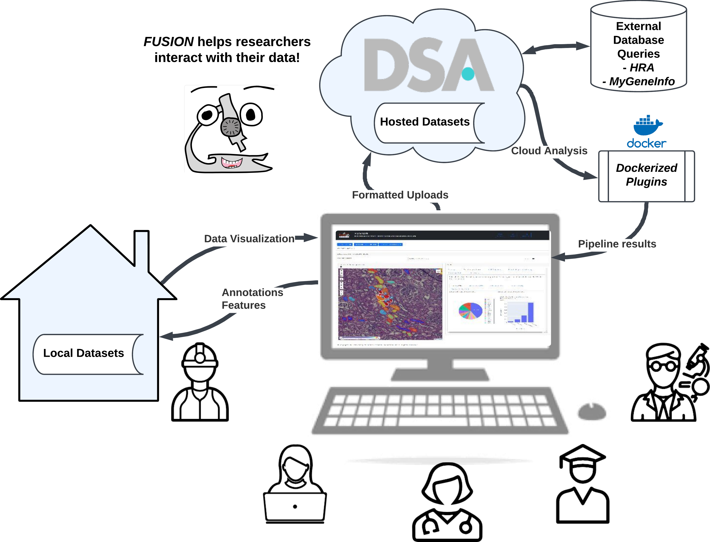
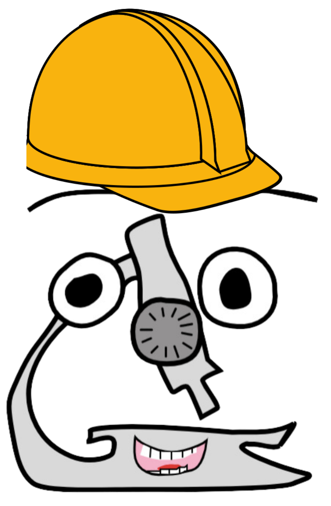

Background
===============

How did *fusion-tools* start?
-------------------------------

*fusion-tools* was designed in collaboration with pathologists and cell biologists 
to streamline communication and facilitate interactive analysis on whole slide images (WSIs). 

One of the main guiding principles behind *fusion-tools* is that annotated or segmented 
structures contain valuable data and by putting those data units (functional tissue units if 
you work with HuBMAP) in a spatial context, the result is greater than the sum of its parts. 
The addition of spatial or relative positional information allows us as researchers to obtain 
a greater understanding of whether a particular signal that is observed is diffuse or localized. 
While this is not new by any means in the field of pathology, utilizing computational image analysis 
and other techniques can enable this information to be quantitatively captured and used to provide 
a basis for comparison across many individual samples. 

What makes *fusion-tools* different from __________?
------------------------------------------------------

Many similar tools are emerging these days which also facilitate visualization of WSI and overlaid 
annotations. Of course, whichever tool you are already most familiar with you will probably 
find easier to use than any new tool. However, there are several functionalities which we 
would argue are easier to accomplish in *fusion-tools* than in other tools.

These include:
1. Multiple levels of interactive analysis and annotation
^^^^^^^^^^^^^^^^^^^^^^^^^^^^^^^^^^^^^^^^^^^^^^^^^^^^^^^^^

More than just generating one type of plot, *fusion-tools* includes the ability to dynamically select 
individual or multiple structural properties as well as filters to generate plots which "link" back to 
the original images from which each data point is derived. This makes it much easier to discern 
whether or not a given quantitative measure is capturing "real" data or if it is just noise. 

2. Interoperability for many different types of images
^^^^^^^^^^^^^^^^^^^^^^^^^^^^^^^^^^^^^^^^^^^^^^^^^^^^^^

*fusion-tools*\' main image reader is `large-image <https://github.com/girder/large_image>`_ which covers 
a vast array of tile sources (OpenSlide, DeepZoom, DICOM, OME-TIFF, ZARR, GDAL, etc.). 

3. Several types of input annotation formats allowed
^^^^^^^^^^^^^^^^^^^^^^^^^^^^^^^^^^^^^^^^^^^^^^^^^^^^^

By default, *fusion-tools* works with `GeoJSON <https://geojson.org/>`_ formatted annotations. However, 
read functions are included for `Aperio ImageScope \(.xml\) <https://www.leicabiosystems.com/us/digital-pathology/manage/aperio-imagescope/>`_, 
`large\-image annotations \(HistomicsUI\) \(.json\) <https://girder.github.io/large_image/annotations.html>`_, as well as 
a few special formats. In general, GeoJSON formatted annotations are the easiest to work with, and enable direct 
embedding of key structural identification properties.

4. Extensability
^^^^^^^^^^^^^^^^^

Using Dash as the main framework enables users to embed custom components in the form of DashBlueprint objects 
with interactive callbacks that can extend across built-in components. Furthermore, developers more familiar with 
JavaScript can take advantage of *clientside\_callback*s in custom components or they can even `convert React components 
into Dash components <https://dash.plotly.com/plugins>`_\ .

Where should I start?
----------------------

Start by taking a look at the documentation for the Visualization class and go over how to create custom 
layouts with multiple components and pre-loading your session with locally stored data. Then go over the 
interactive properties of each Component to see if your use case is already covered. If it isn't, read 
through the examples for designing *CustomComponent*s or submit a PR with a feature request and we'd be 
happy to help!

Happy Fusing!

